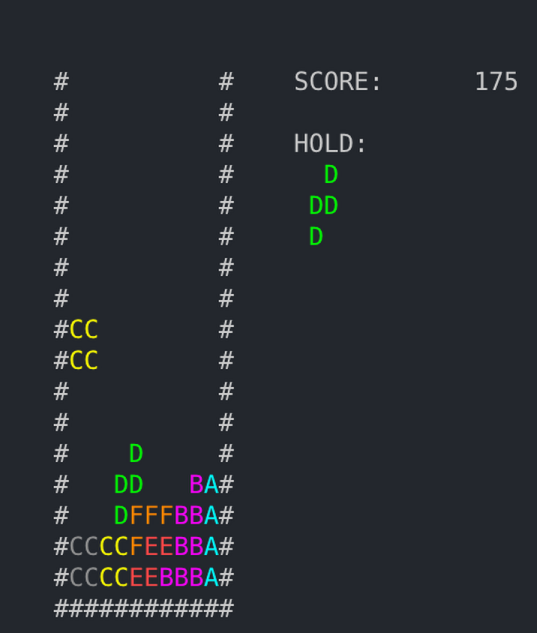

# Command Line Tetris — Linux Port

Linux port of Javidx9 / OneLoneCoder's **Command Line Tetris**.

The original game structure and logic are kept largely intact, with the Windows console/input code replaced by a small POSIX terminal layer.

## Changes

- POSIX terminal handling via `termios`
- Nonblocking keyboard input and escape-sequence parsing
- ANSI terminal rendering instead of Win32 console APIs
- ANSI 256-color tetrominoes
- `Q` to quit cleanly

## Build

Requires a C++17 compiler and an ANSI-compatible terminal of at least 80×30.

```bash
mkdir -p build
g++ -std=c++17 -O2 -Wall -Wextra -pedantic main.cpp -o build/tetris
./build/tetris
```

## Controls

| Key | Action |
| --- | --- |
| Left Arrow | Move left |
| Right Arrow | Move right |
| Down Arrow | Move down |
| `Z` | Rotate |
| `Q` | Quit |

## Attribution & License

Based on **OneLoneCoder.com - Command Line Tetris** by Javidx9 / OneLoneCoder.

Original source:  
https://github.com/OneLoneCoder/Javidx9/blob/master/SimplyCode/OneLoneCoder_Tetris.cpp

Original project:  
https://github.com/OneLoneCoder/Javidx9

The source used for this port carries a GNU GPLv3 notice. This repository is distributed under **GPL-3.0-only** and retains the original attribution.

See `LICENSE`.

Original work Copyright (C) 2018 Javidx9.

This is an unofficial port and is not affiliated with OneLoneCoder or The Tetris Company.